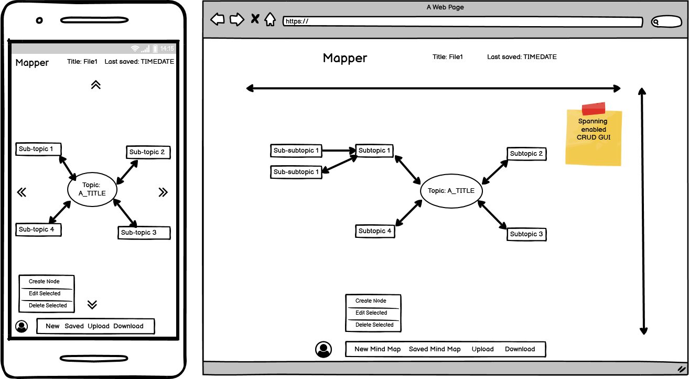

# Mapper

###### Trello board to keep me on track
https://trello.com/b/IK0n1wgd/guided-side-app-t3

## Overview
Mapper is a visual mind mapping platform that employ CRUD operations to manage your data. Users will be able to create a database using GUI and also able to upload their database to create a visual represention of their database.

## Local Install Steps
The app makes use of the venv pip package to create a virtual environment. Therefore the package will need to be installed in order to run the app. There after the install instructions are as below:
- Clone the repo: `git clone https://github.com/blah88/mapper.git`
- Change directory into the repo: `cd mapper`
- Make sure venv is installed: `pip install venv`
- Create the virtual environment: `python3 -m venv venv`
- Activate the virtual environment: `source venv/bin/activate`
- Install the dependencies from requirments.txt: `pip3 install -r requirements.txt`
- Run the app: `python src/main.py`

## CI/CD
The CI/CD pipeline was created using Github Actions. It uses Python3.8, Pip3 and runs on the latest stable version of Ubuntu. The pipeline is started on a push to master.
Once it has pulled from master it installs the dependencies form requirements.txt and then it runs the tests in the tests directory.

## Wireframes
#### Known missing wire frames

1. Settings page
2. Upload page
3. Sign up page

#### Landing/Log in page
This is the login/landing page. User will be able to go to sign up page or log into their account to the dashboard page. 

#### Dashboard
This the page that user will go to after logging in.

#### New Mindmap
This is the page when users create a new mindmap.

#### Sub-topic page
This is the page when you click on a sub topic in a mindmap page. Every node will be accessible and editable.

